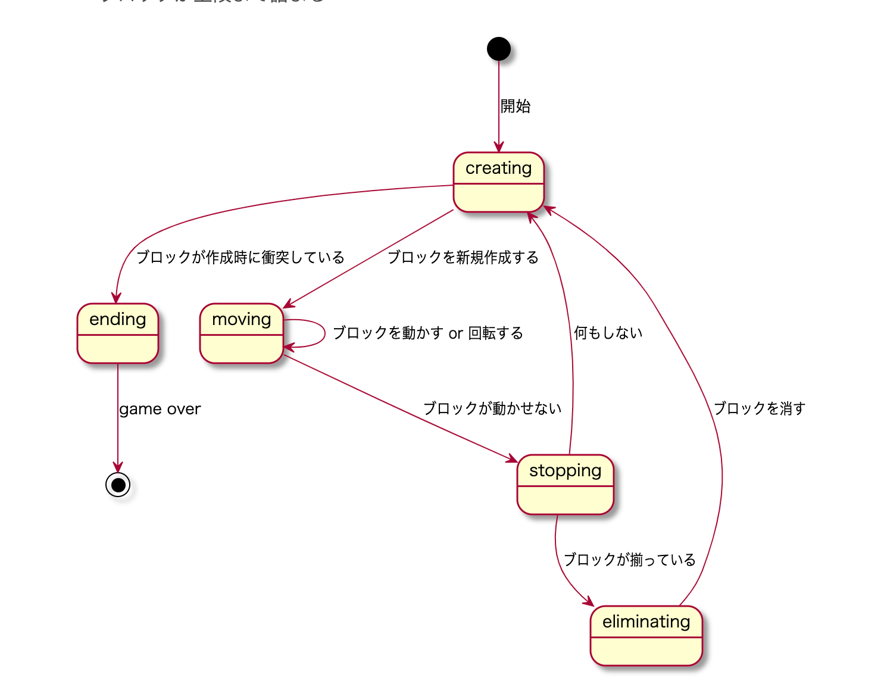

## Tetris written by Typescript

URL: https://ts-tetris.netlify.com

### Web UI


### Terminal


### プレイ方法

```shell
npm install
npm run play:console  # console
npm run play:web      # web
```

### 技術スタックなど

- Typescript: 3.7.4
- Node: v13.5.0
- Vue.js: 2.6.11

### 盤面の構造
```
縦20行 × 横10列

↓イメージこんな感じ
＊・・・・・・・・・・＊
＊・・・・・・・・・・＊
＊・・・・・・・・・・＊
＊・・・・・・・・・・＊
＊・・・・・・・・・・＊
＊・・・・・・・・・・＊
＊・・・・・・・・・・＊
＊・・・・・・・・・・＊
＊・・・・・・・・・・＊
＊・・・・・・・・・・＊
＊・・・・・・・１・・＊
＊・・・・・・・Ｘ１・＊
＊・・・・・・・・１・＊
＊・・・・・・・・・・＊
＊・・・・・・・・・・＊
＊・・・・・・・・・・＊
＊・・・・・・・・・・＊
＊・・・・・・・０・・＊
＊・・・０００００・・＊
＊・００００・００・・＊
＊＊＊＊＊＊＊＊＊＊＊＊
```

- `＊`：壁衝突判定用ブロック（横は 12 列、縦 21 列になる）
- `０`：固定化されているブロック
- `１`：動かしているブロック


## 盤面の状態
盤面のステートマシンを作る

- moving
    - ブロックを移動できる
- creating
    - 新しいブロックを作る
- stopping
    - ブロックを止める
- eliminating
    - ブロックを消去する
- ending
    - ブロックが上段まで詰まる

```{plantuml}
[*] --> creating: 開始
creating --> moving: ブロックを新規作成する
moving --> moving: ブロックを動かす or 回転する
moving --> stopping: ブロックが動かせない
stopping --> eliminating: ブロックが揃っている
eliminating --> creating: ブロックを消す
stopping --> creating: 何もしない
creating --> ending: ブロックが作成時に衝突している
ending --> [*]: game over
```




## ブロックの種類と回転
回転の中心は `Ｘ` とする、時計回りに回転する

```
O型
１１
１１

T形
・・・
・Ｘ・
１１１

Z型
・・・
１Ｘ・
・１１

Z_t型
・・・
・Ｘ１
１１・

L型
・１・
・Ｘ・
・１１

L_t型
・１・
・Ｘ・
１１・

I型
タイプＲ（Next Right）
・１・・
・Ｒ・・
・１・・
・１・・

タイプＢ（Next Bottom）
・・・・
１１Ｂ１
・・・・
・・・・

タイプＬ（Next Left）
・・１・
・・１・
・・Ｌ・
・・１・

タイプＵ（Next Top）
・・・・
・・・・
１Ｔ１１
・・・・
```

- O 型の回転：
    - 回転なし
- T形・Z型・Z_t型・L型・L_t型の回転：
    - 回転例
        ```
        ABC
        DEF
        GHI
        ↓
        GDA
        HEB
        IFC
        ```
    - Ｘ を中心にして回転
    - 座標系
        - (1, 1) => (1, 3)
        - (1, 2) => (2, 3)
        - (1, 3) => (3, 3)
        - (2, 1) => (1, 2)
        - (2, 2) => (2, 2)
        - (2, 3) => (3, 2)
        - (3, 3) => (3, 1)
        - (3, 2) => (2, 1)
        - (3, 1) => (1, 1)
- I 型の回転
    - 状態遷移
        - T -> R
        - R -> B
        - B -> L
        - L -> T

- 回転衝突パターンで回転できるかチェック（Oパターン以外）
    1. 回転操作
    2. 回転不可ブロックがあった場合は回転軸との差異を見て右か左に遷移
        - I パターン以外の時： X との差を見れば OK
        - I パターンの時：棒の左端上端などで遷移方向チェック
    3. ブロックチェック
    4. 被っていたらもう一度同方向に移動（I パターンの時のみ）
        - I パターン以外の時はこの時点で回転できない
    5. ブロックチェック
    6. 回転できない